# AWS Transit Gateway Lab: Hub-and-Spoke with Branch Isolation

I built this lab while studying for the AWS SAA-C03 exam. The goal was to connect three VPCs through a Transit Gateway so that a central "core" VPC can talk to two branch VPCs, but the two branches can't talk to each other.

The interesting part for me was that there's no "deny" rule anywhere. The branches are isolated just because the routes between them never exist.

## Architecture

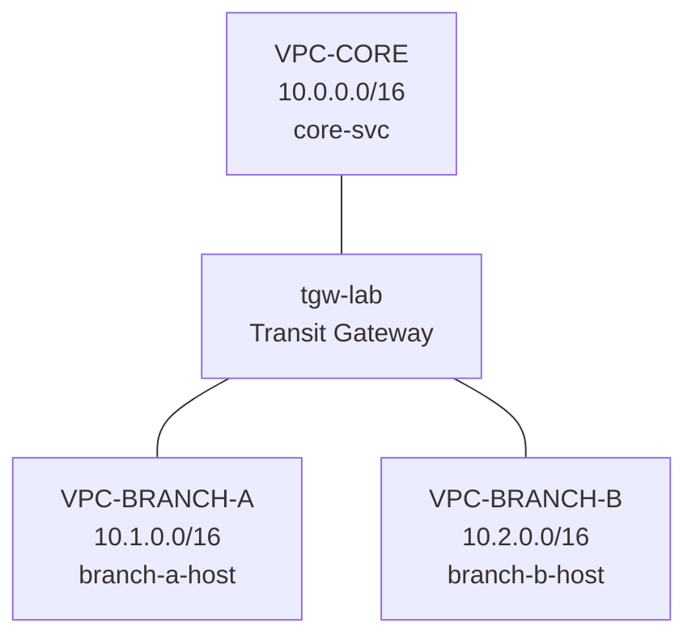

Both branches are attached to the same Transit Gateway, but there is no route between Branch A and Branch B.

What I expected to see at the end:

| From | To | Expected |
|---|---|---|
| branch-a-host | core-svc | works |
| branch-b-host | core-svc | works |
| core-svc | both branches | works |
| branch-a-host | branch-b-host | should fail |

## Setup

- Region: ap-southeast-1 (Singapore), everything in ap-southeast-1a
- EC2: Amazon Linux 2023, t3.micro
- Each instance runs Apache so I can test with curl

| VPC | CIDR | Subnet | Instance | Private IP |
|---|---|---|---|---|
| VPC-CORE | 10.0.0.0/16 | core-public-1 (10.0.1.0/24) | core-svc | 10.0.1.154 |
| VPC-BRANCH-A | 10.1.0.0/16 | branch-a-public-1 (10.1.1.0/24) | branch-a-host | 10.1.1.234 |
| VPC-BRANCH-B | 10.2.0.0/16 | branch-b-public-1 (10.2.1.0/24) | branch-b-host | 10.2.1.28 |

I picked the CIDRs so the second number tells you which site it is (10.0 core, 10.1 branch A, 10.2 branch B). It made the route tables much easier to read later.

## How the isolation works

### 1. Turn off the TGW defaults

When creating the Transit Gateway I unchecked **Default route table association** and **Default route table propagation**. If these stay on, all attachments go into one shared route table and everything can reach everything, which breaks the whole point of the lab.

### 2. Two TGW route tables

I created one attachment per VPC (`attach-core`, `attach-branch-a`, `attach-branch-b`) and two route tables:

| Route table | Associated with | Propagations | Routes it ends up with |
|---|---|---|---|
| rt-core | attach-core | attach-branch-a, attach-branch-b | 10.1.0.0/16, 10.2.0.0/16 |
| rt-branches | attach-branch-a, attach-branch-b | attach-core | 10.0.0.0/16 |

The way I remember it:
- Association = which table I look at when I send traffic
- Propagation = which tables my CIDR gets added to so others can find me

Since neither branch CIDR is propagated into rt-branches, Branch A has no route to Branch B and the TGW just drops the packet.

### 3. VPC route tables

The TGW route tables aren't enough on their own. Each VPC's subnet route table also needs to send traffic to the TGW:

| Route table | Added route |
|---|---|
| core-public-1 | 10.1.0.0/16 and 10.2.0.0/16 → tgw-lab |
| branch-a-public-1 | 10.0.0.0/16 → tgw-lab |
| branch-b-public-1 | 10.0.0.0/16 → tgw-lab |

### 4. Security groups

| Instance | Inbound |
|---|---|
| core-svc | SSH from my IP, HTTP from 10.1.0.0/16 and 10.2.0.0/16 |
| branch-a-host | SSH from my IP, HTTP from 10.0.0.0/16 |
| branch-b-host | SSH from my IP, HTTP from 10.0.0.0/16 |

Routing already blocks branch to branch traffic, but I didn't open the security groups between the branches either, just to be safe.

## User data

```bash
#!/bin/bash
dnf install -y httpd
systemctl enable --now httpd
TOKEN=$(curl -s -X PUT "http://169.254.169.254/latest/api/token" -H "X-aws-ec2-metadata-token-ttl-seconds: 21600")
PRIVIP=$(curl -s -H "X-aws-ec2-metadata-token: $TOKEN" http://169.254.169.254/latest/meta-data/local-ipv4)
echo "<h1>$(hostname): $PRIVIP</h1>" > /var/www/html/index.html
```

## Testing

I SSH'd into each instance and ran curl against the others with a 5 second timeout:

```bash
curl -m 5 http://<private-ip>
```

| From | To | Result |
|---|---|---|
| branch-a-host | core-svc | got the HTML page |
| branch-a-host | branch-b-host | Connection timed out after 5002 ms |
| branch-b-host | core-svc | got the HTML page |
| branch-b-host | branch-a-host | Connection timed out after 5002 ms |
| core-svc | branch-a-host | got the HTML page |
| core-svc | branch-b-host | got the HTML page |

Everything matched what I expected. The branch to branch tests time out instead of getting "connection refused", which makes sense because the packet never reaches the other host. There's just no route for it.

## Problems I ran into

**The web page showed no IP address.** The original user data script used the old metadata call without a token. Amazon Linux 2023 only allows IMDSv2 by default, so the call returned nothing. I switched to the token version above.

**I added user data after launching.** I forgot to paste the script before launching the first time. User data only runs on first boot, so I had to relaunch the instances.

**I mixed up association and propagation.** My first attempt had rt-core with a route to 10.0.0.0/16 (its own VPC) and the branch routes in rt-branches, which is completely backwards. I only noticed by looking at the Routes tab. Fixed it by deleting and recreating the propagations on the right tables.

**Security group rules weren't applying.** When I relaunched with "Launch more like this", AWS created new security groups with -1, -2, -3 at the end. I had been editing the old ones. Lesson learned: check the instance's Security tab to see which group is actually attached.

**EC2 Instance Connect didn't work.** Because SSH was limited to my IP, the browser based Instance Connect couldn't get in (it connects from AWS's IP range, not mine). I used SSH from my Mac terminal with the key pair instead.

## What I learned

- TGW isolation is about which routes exist, not about blocking rules.
- Association and propagation are easy to confuse. Checking the actual Routes tab is the fastest way to catch mistakes.
- You need routes in both places: the VPC route table and the TGW route table.

## Screenshots

### VPCs
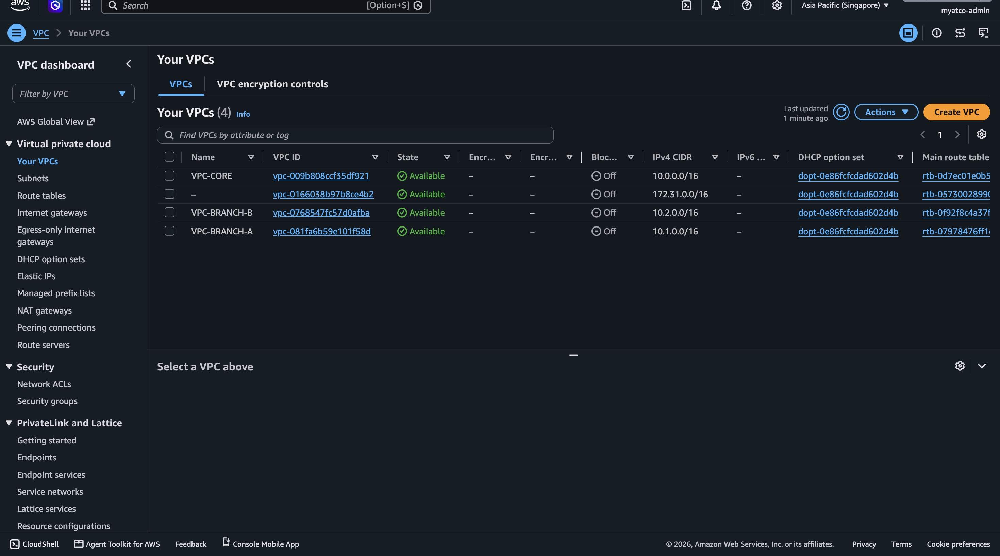

### Transit Gateway settings
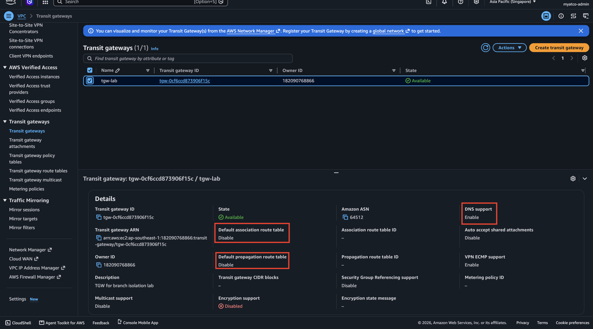

### TGW attachments
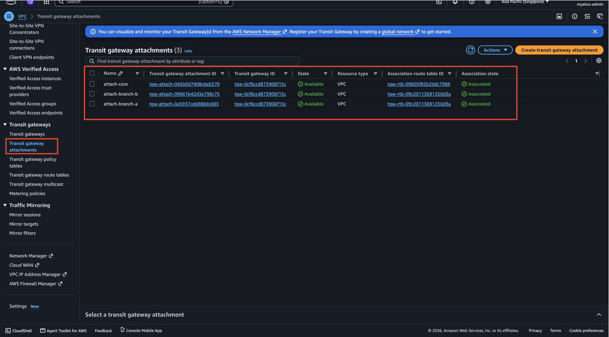

### rt-core
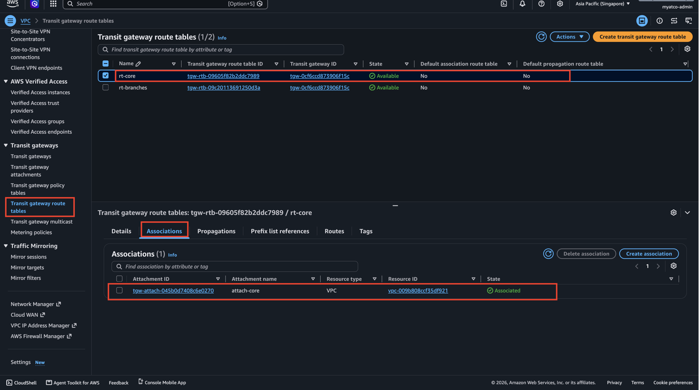
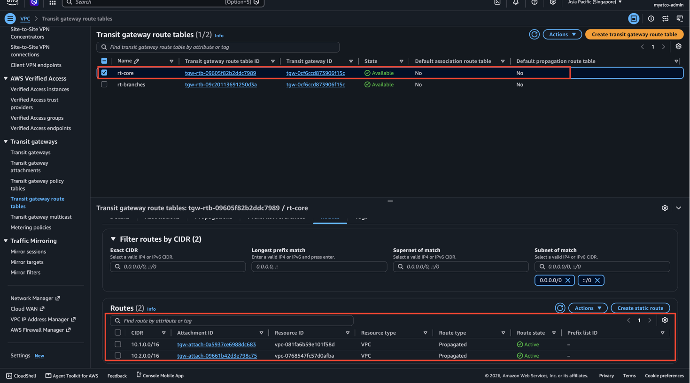

### rt-branches
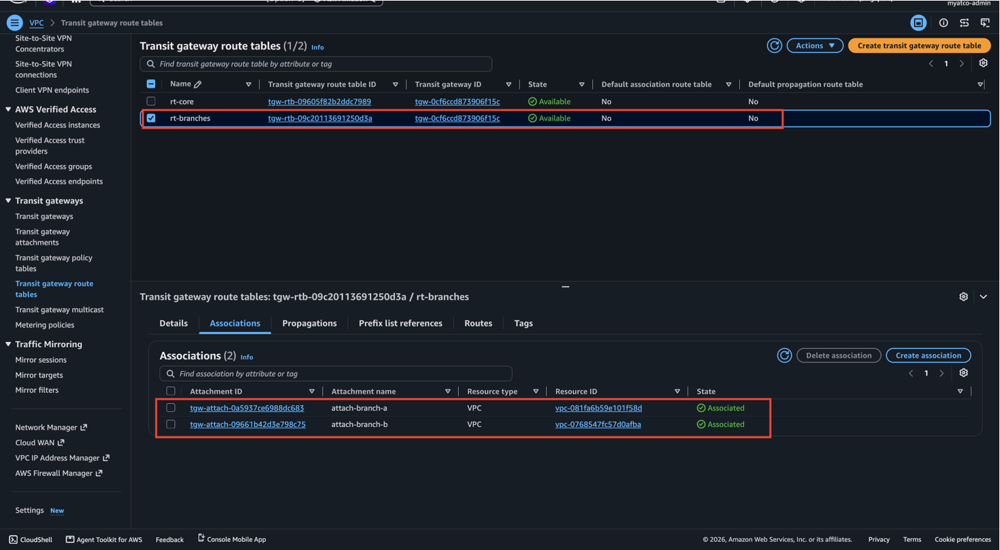
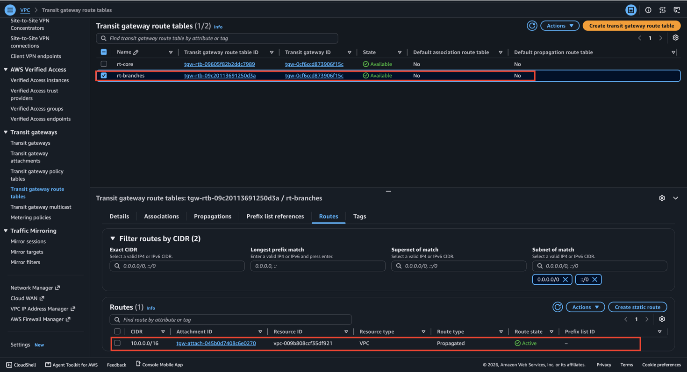

### VPC route tables
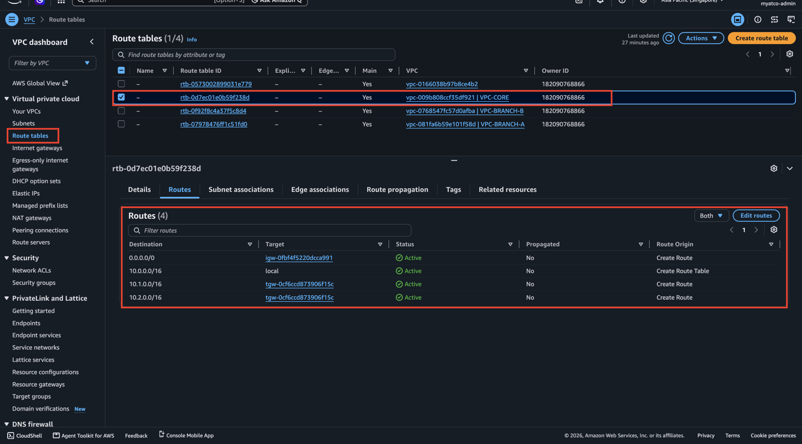
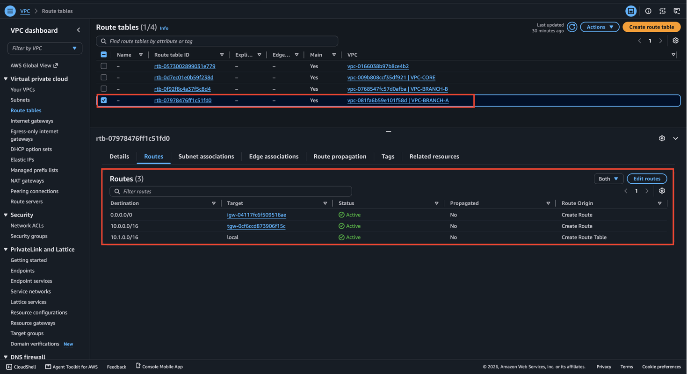
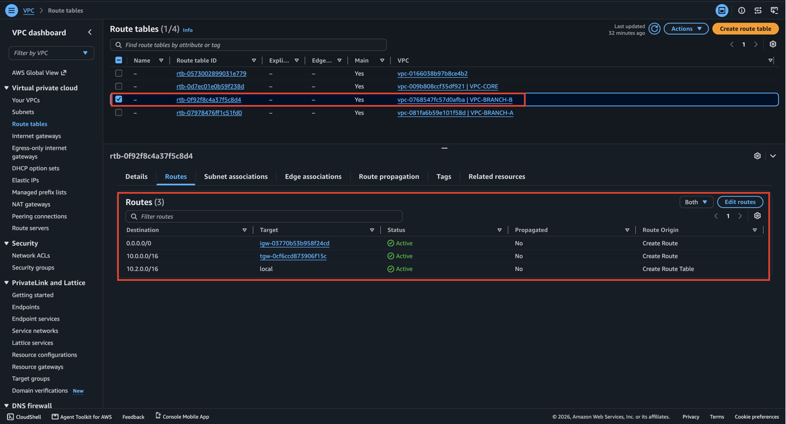

### Security groups
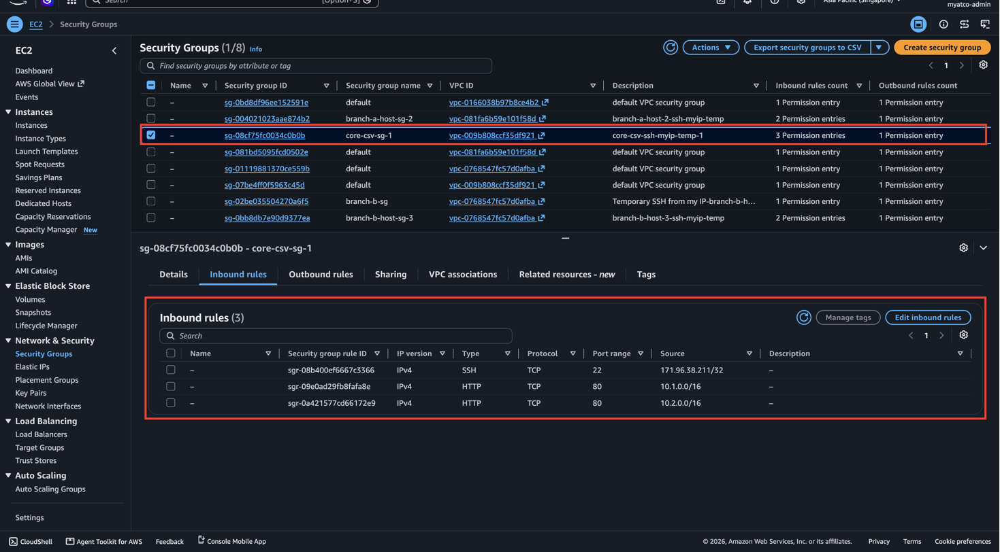
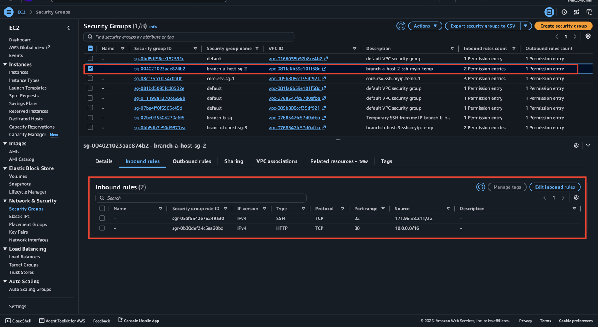
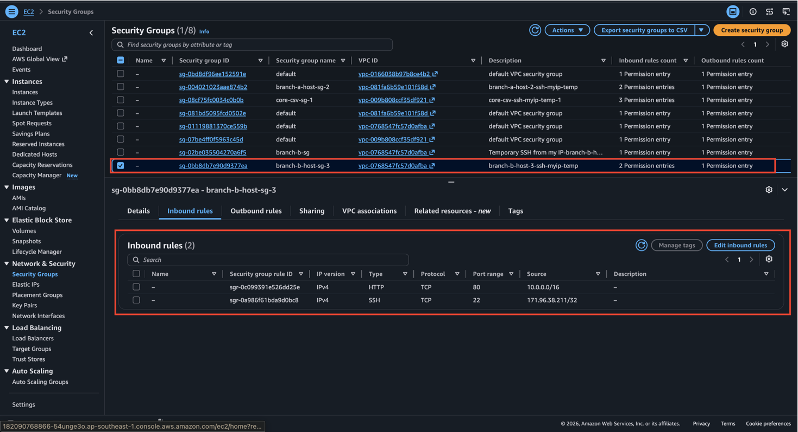

### curl tests
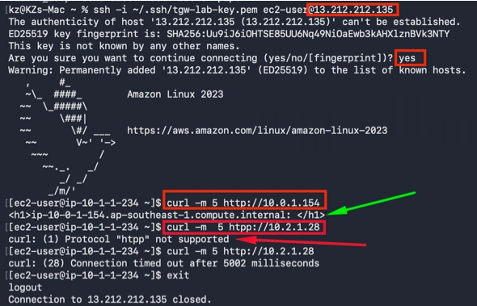
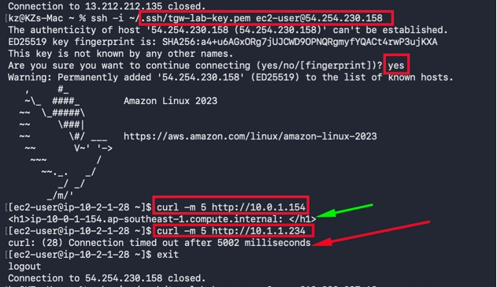
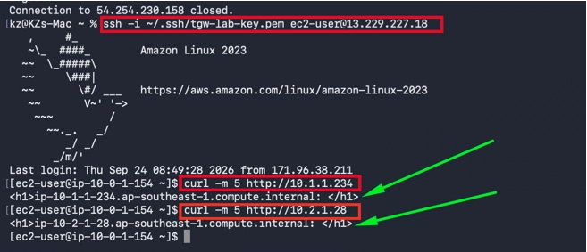

## Cleanup

Deleted everything afterwards so I wouldn't keep paying for the TGW attachments: instances, TGW attachments, TGW route tables, the TGW itself, the VPCs, and the key pair.
