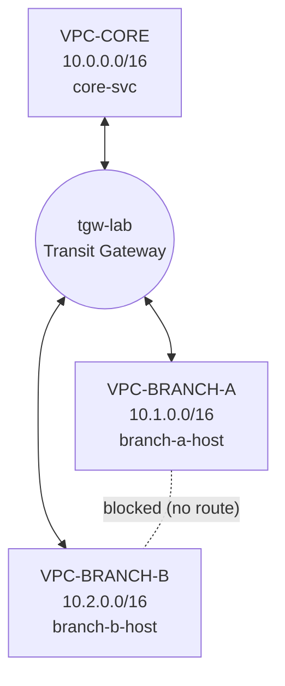

# AWS Transit Gateway — Hub-and-Spoke with Branch Isolation

A hands-on AWS networking lab that connects three VPCs through a Transit Gateway, where the hub (core) can reach both branches, but the two branches **cannot** reach each other. Isolation is achieved purely through Transit Gateway route table **association** and **propagation** — no deny rules anywhere.

## Architecture



**Target behavior**

| From | To | Result |
|---|---|---|
| branch-a-host | core-svc | ✅ Reachable |
| branch-b-host | core-svc | ✅ Reachable |
| core-svc | branch-a-host / branch-b-host | ✅ Reachable |
| branch-a-host | branch-b-host | ❌ Not reachable (by design) |

## Environment

- **Region:** ap-southeast-1 (Singapore)
- **Availability Zone:** ap-southeast-1a
- **Instances:** Amazon Linux 2023, t3.micro
- **Web server:** Apache (httpd) installed via EC2 user data

## CIDR Plan

| Site | VPC | VPC CIDR | Subnet | Subnet CIDR | EC2 | Private IP |
|---|---|---|---|---|---|---|
| Hub / shared services | VPC-CORE | 10.0.0.0/16 | core-public-1 | 10.0.1.0/24 | core-svc | 10.0.1.154 |
| Branch A | VPC-BRANCH-A | 10.1.0.0/16 | branch-a-public-1 | 10.1.1.0/24 | branch-a-host | 10.1.1.234 |
| Branch B | VPC-BRANCH-B | 10.2.0.0/16 | branch-b-public-1 | 10.2.1.0/24 | branch-b-host | 10.2.1.28 |

Non-overlapping /16 blocks keep Transit Gateway routing simple — the second octet identifies the site.

## Transit Gateway Design

The Transit Gateway was created with **Default route table association** and **Default route table propagation** both **disabled**. If left enabled, every attachment joins one shared route table and learns every other attachment's routes, giving full-mesh connectivity and defeating the segmentation.

### Attachments

| Attachment | VPC | Subnet |
|---|---|---|
| attach-core | VPC-CORE | core-public-1 |
| attach-branch-a | VPC-BRANCH-A | branch-a-public-1 |
| attach-branch-b | VPC-BRANCH-B | branch-b-public-1 |

### TGW Route Tables

| Route table | Associated with (who uses it) | Propagations (who can be reached) | Resulting routes |
|---|---|---|---|
| rt-core | attach-core | attach-branch-a, attach-branch-b | 10.1.0.0/16, 10.2.0.0/16 |
| rt-branches | attach-branch-a, attach-branch-b | attach-core | 10.0.0.0/16 only |

- **Association** = which route table an attachment's outbound traffic is looked up in.
- **Propagation** = which route tables an attachment's CIDR is advertised into.

Because neither branch CIDR is ever propagated into `rt-branches`, a packet from Branch A to Branch B has no matching route and is silently dropped by the TGW.

### VPC Subnet Route Tables

| Subnet route table | Routes added |
|---|---|
| core-public-1 | 10.1.0.0/16 → tgw-lab, 10.2.0.0/16 → tgw-lab |
| branch-a-public-1 | 10.0.0.0/16 → tgw-lab |
| branch-b-public-1 | 10.0.0.0/16 → tgw-lab |

Each also keeps `local` and `0.0.0.0/0 → Internet Gateway` (for SSH and package installs).

### Security Groups (defense in depth)

| Security group | Inbound rules |
|---|---|
| core-svc-sg | SSH 22 ← My IP, HTTP 80 ← 10.1.0.0/16, HTTP 80 ← 10.2.0.0/16 |
| branch-a-sg | SSH 22 ← My IP, HTTP 80 ← 10.0.0.0/16 |
| branch-b-sg | SSH 22 ← My IP, HTTP 80 ← 10.0.0.0/16 |

Routing already blocks branch-to-branch traffic; the security groups state the same intent explicitly in case the network path ever changes.

## Implementation Steps

1. Planned non-overlapping CIDR blocks and chose a single Region.
2. Created three VPCs, each with one public subnet, an Internet Gateway and a route table.
3. Created one key pair and reused it for all three instances.
4. Launched three EC2 instances with user data that installs httpd and publishes the hostname and private IP.
5. Created the Transit Gateway with default association and propagation **disabled**.
6. Created one VPC attachment per VPC and waited for all to become Available.
7. Created two TGW route tables (`rt-core`, `rt-branches`) and configured associations and propagations.
8. Added routes to each VPC subnet route table pointing remote CIDRs at the Transit Gateway.
9. Added HTTP inbound rules to the security groups.
10. Verified connectivity with `curl` from every instance.

## User Data Script

```bash
#!/bin/bash
dnf install -y httpd
systemctl enable --now httpd
TOKEN=$(curl -s -X PUT "http://169.254.169.254/latest/api/token" -H "X-aws-ec2-metadata-token-ttl-seconds: 21600")
PRIVIP=$(curl -s -H "X-aws-ec2-metadata-token: $TOKEN" http://169.254.169.254/latest/meta-data/local-ipv4)
echo "<h1>$(hostname): $PRIVIP</h1>" > /var/www/html/index.html
```

## Verification

Tests were run over SSH from each instance using a 5-second timeout so blocked paths fail quickly:

```bash
curl -m 5 http://<target-private-ip>
```

| From | To | Result |
|---|---|---|
| branch-a-host | core-svc (10.0.1.154) | ✅ HTML returned |
| branch-a-host | branch-b-host (10.2.1.28) | ❌ `Connection timed out after 5002 milliseconds` |
| branch-b-host | core-svc (10.0.1.154) | ✅ HTML returned |
| branch-b-host | branch-a-host (10.1.1.234) | ❌ `Connection timed out after 5002 milliseconds` |
| core-svc | branch-a-host (10.1.1.234) | ✅ HTML returned |
| core-svc | branch-b-host (10.2.1.28) | ✅ HTML returned |

A **timeout** (rather than an immediate "connection refused") is the expected signature of a missing route: the packet has nowhere to go and is dropped, instead of reaching the host and being rejected.

## Screenshots

### VPCs


### Transit Gateway (default association/propagation disabled)


### TGW Attachments


### rt-core


### rt-branches


### VPC Subnet Route Tables


### Security Groups


### Verification (curl)


## Issues I Encountered and How I Fixed Them

**1. Private IP missing from the web page**
The original user data used IMDSv1 (`curl http://169.254.169.254/...` without a token). Amazon Linux 2023 requires IMDSv2 by default, so the request returned nothing and the page showed an empty IP. Fixed by requesting a session token first (see script above).

**2. User data added after launch had no effect**
User data only runs on the instance's first boot. I relaunched the instances with the script included and terminated the originals.

**3. TGW propagations applied to the wrong route tables**
I initially propagated `attach-core` into `rt-core` (so core's table only pointed back at itself) and the branches into `rt-branches` (which would have let the branches reach each other). Checking each table's Routes tab exposed the mistake; I deleted and recreated the propagations on the correct tables.

**4. Security group rules not taking effect**
"Launch more like this" created new security groups (`-1`, `-2`, `-3`) instead of reusing the originals, so the HTTP rules I edited were attached to the terminated instances' groups. I checked each instance's Security tab, switched them to the intended groups, and deleted the extras.

**5. EC2 Instance Connect unavailable**
With SSH restricted to My IP, browser-based Instance Connect fails because its traffic originates from an AWS-managed IP range. I connected from my own terminal using the key pair instead.

## Key Learnings

- Transit Gateway segmentation is done with **multiple route tables**, not deny rules — a route that was never propagated cannot be used.
- **Association** controls where an attachment looks up routes; **propagation** controls where its CIDR is advertised. An attachment is associated with exactly one route table but can propagate to many.
- Disabling default association and propagation when creating the TGW is essential for any segmented design.
- Both layers of routing are required: the **VPC subnet route table** must send remote CIDRs to the TGW, and the **TGW route table** decides where traffic goes next.
- Always verify the route table actually associated with a subnet, the security group actually attached to an instance, and the actual Routes tab — not just the configuration you intended.

## Cleanup

Resources were deleted in dependency order to avoid ongoing charges:

1. EC2 instances
2. Transit Gateway attachments
3. Transit Gateway route tables
4. Transit Gateway
5. VPCs (including subnets, route tables, Internet Gateways and security groups)
6. Key pair
